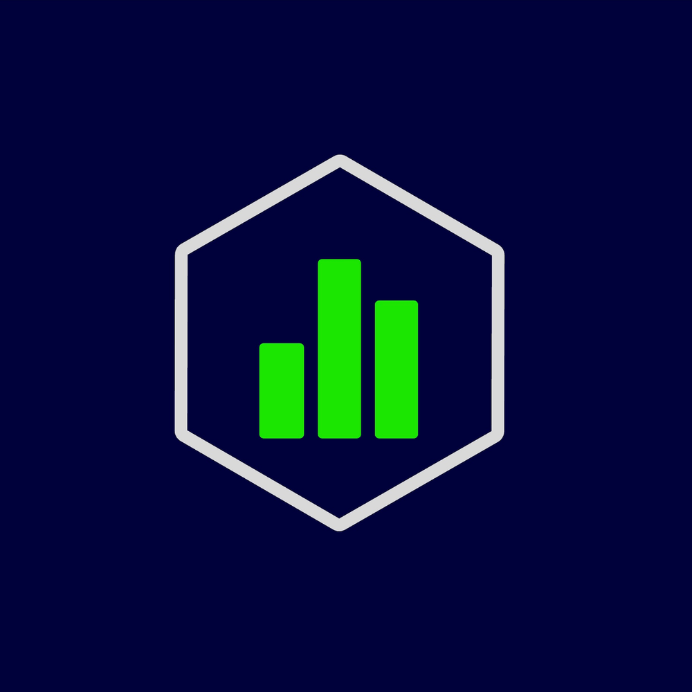

<p align="center">
  
</p>

<h1 align="center">Draft IQ</h1>

<p align="center">
  <b>The ultimate platform for sports prop trading and analytics.</b>
</p>

<p align="center">
  
  
  
  
</p>

---

## 🚀 Overview

Draft IQ is a cutting-edge sports prop trading platform that allows users to analyze and trade player props across multiple sports (NBA, NFL, etc.). With real-time data integration and a sleek, intuitive terminal interface, Draft IQ empowers traders to make informed decisions and track their portfolios with precision.

## ✨ Key Features

- 🏟️ **Active Markets:** Real-time player props and game data for major sports leagues.
- 📈 **Trading Terminal:** Professional-grade interface for executing and monitoring trades.
- 💼 **Portfolio Management:** Track your active positions, history, and performance metrics.
- 🏆 **Leaderboards:** Compete with other traders and climb the rankings.
- 📊 **Analytics Dashboard:** Deep-dive into metrics and market trends.
- 🤝 **Community:** Engage with other traders and share insights.
- 🔒 **Secure Auth:** Seamless authentication and user management via Supabase.

## 🛠️ Tech Stack

- **Frontend:** [Next.js](https://nextjs.org/) (App Router), [React](https://reactjs.org/), [Tailwind CSS](https://tailwindcss.com/)
- **Backend:** [Supabase](https://supabase.com/) (Database, Auth, Storage)
- **UI Components:** [Radix UI](https://www.radix-ui.com/), [Lucide React](https://lucide.dev/)
- **Charts/Graphs:** [Recharts](https://recharts.org/)
- **Data APIs:** The Odds API, Kalshi

## 🏁 Getting Started

### Prerequisites

- [Node.js](https://nodejs.org/) (v18 or higher)
- [Bun](https://bun.sh/) or npm/yarn/pnpm

### Installation

1. Clone the repository:
   ```bash
   git clone <your-repo-url>
   cd draft-iq
   ```

2. Install dependencies:
   ```bash
   bun install
   ```

3. Set up environment variables:
   Create a `.env.local` file and add the following:
   ```env
   NEXT_PUBLIC_SUPABASE_URL=your_supabase_url
   NEXT_PUBLIC_SUPABASE_ANON_KEY=your_supabase_anon_key
   SUPABASE_SERVICE_ROLE_KEY=your_supabase_service_role_key
   THE_ODDS_API_KEY=your_odds_api_key
   ```

4. Run the development server:
   ```bash
   bun dev
   ```

Open [http://localhost:3000](http://localhost:3000) with your browser to see the result.

## 📁 Project Structure

- `src/app/` - Next.js App Router pages and API routes.
- `src/components/` - Reusable UI components and page sections.
- `src/hooks/` - Custom React hooks for data fetching and state.
- `src/lib/` - Utility functions and shared library configurations.
- `public/` - Static assets (logos, icons, etc.).

---

<p align="center">
  Built with ❤️ for the next generation of sports traders.
</p>
